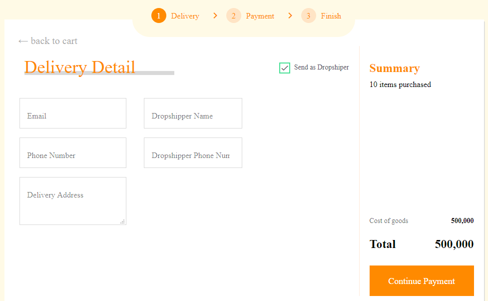
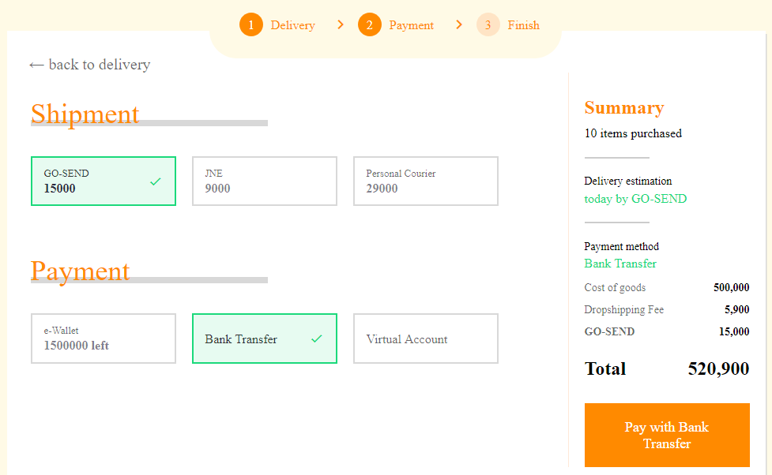
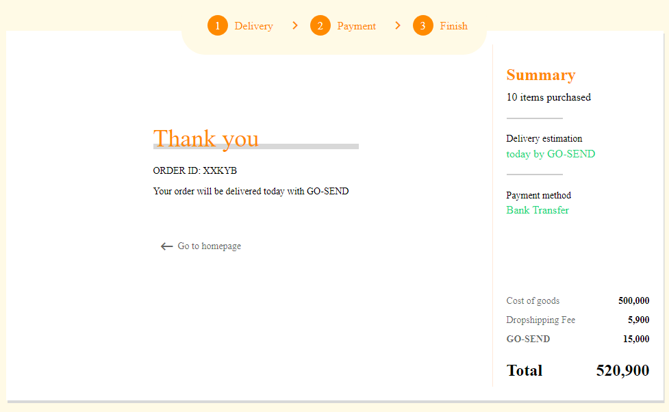

# Shoping Cart

create a shopping cart using vuejs

> I spent quite a bit of time creating BEM CSS :(

## Mandatory Stack

- Vuejs
- Yarn
- Material Icon
- Stylus CSS
- BEM css methods

## Looking





### Introduce

1. add basic Matrial Icons in `HTML` publc file, useful to add many icon components

```html
<link
  href="https://fonts.googleapis.com/css2?family=Inter:wght@400;500;700&family=Montserrat:wght@700&display=swap"
  rel="stylesheet"
/>
<link
  href="https://fonts.googleapis.com/icon?family=Material+Icons"
  rel="stylesheet"
/>
```

2. add validation package for helping the form, import to our `main.js` root file

```javascript
import { createApp } from 'vue';
import { VuelidatePlugin } from '@vuelidate/core';
import App from './App.vue';
import 'normalize.css';

const app = createApp(App);
app.use(VuelidatePlugin);
app.mount('#app');
```

### Minus

- Realtime count in text area
- redirect to Finish Page has trouble, must click `back action` to delivery first
- missing font type
- width line border still to small
- Phone number validation
- random 5 digit alphanumerik
- needed refactoring for clean function :(
